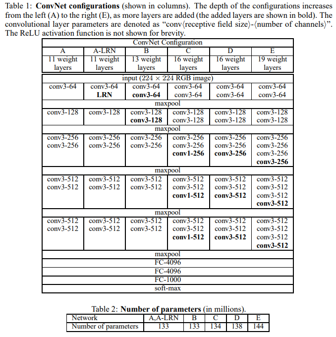
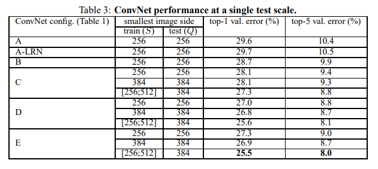

# 🖋 VGG-PyTorch-Implementation

This repository contains a replication of the **VGG16 (Very Deep Convolutional Networks for Large-Scale Image Recognition)** model. The goal is to reproduce the **VGG16 architecture** for ImageNet classification using PyTorch.  

> ⚠️ Note: flatten_layer.py and maxpool_layer.py are also included in src/layers/, but they are mostly provided for completeness. The VGG16 model is primarily built using conv_block.py and fc_layer.py. Users who want to implement other VGG variants (from A to E) or custom architectures can easily use these files to create their desired models.

- Only the **VGG16 configuration** was fully implemented.
- The architecture follows multiple convolutional blocks with 3×3 convolutions, ReLU activations, max-pooling layers, flattening, and fully connected layers (4096 → 4096 → 1000).  
**Paper**: [Very Deep Convolutional Networks for Large-Scale Image Recognition (ICLR 2015)](https://arxiv.org/abs/1409.1556)

---

## 🏗 Model Overview

```bash
VGG-Replicating/
│
├── src/
│   ├── layers/
│   │   ├── conv_block.py       → 3x3 Conv + ReLU + N repeats
│   │   ├── maxpool_layer.py    → MaxPool2d layer
│   │   ├── flatten_layer.py    → Flatten (Conv→FC transition)
│   │   └── fc_layer.py         → Fully Connected Layer + ReLU/Dropout
│   │
│   ├── model/
│   │   └── vgg.py              → Conv Blocks + MaxPool + Flatten + FC Layers Assembly
│   │
│   ├── pretrain.py             → Training loop
│   └── config.py               → Hyperparameters, dataset path, optimizer
│
├── images/                      → Architecture and figures
└── requirements.txt             → Python dependencies
```

---

## 📊 Figures

### Figure 1 – VGG Configurations (Table 1 & 2)


- Shows VGG network configurations A–E with convolutional blocks and max-pooling layers.  
- **Observations**:  
  - As depth increases (A → E), classification error generally decreases.  
  - Smaller 3×3 conv filters stacked deeper (D, E) outperform shallower networks with larger filters (A, B).  
  - Table 1: Layer configuration details per model.  
  - Table 2: Number of parameters and computational cost per configuration.  

### Figure 2 – Fully Connected Layers Comparison (Table 3)


- Shows FC6–FC8 layers after flattening the last conv block output, across A–E.  
- **Observations**:  
  - Dropout is applied to the first two fully connected layers (0.5 ratio) across all configurations.  
  - Top-1 and Top-5 error rates improve as we move from A → E.  
  - Deep networks (D, E) with small filters achieve lower errors than shallow networks (A, B, C).  
  - Training with multi-scale inputs further enhances generalization.  
- Dimensions of FC layers: 4096 → 4096 → 1000 features.  

---

## 🔗 Feedback

For questions or feedback, contact: [barkin.adiguzel@gmail.com](mailto:barkin.adiguzel@gmail.com)


